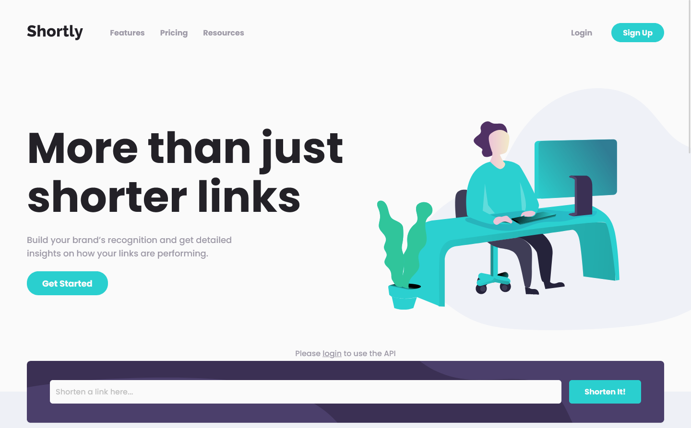
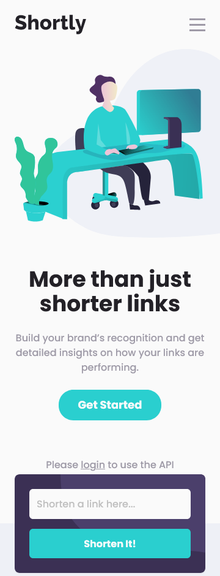

# Frontend Mentor - Shortly URL shortening API Challenge solution

This is a solution to the [Shortly URL shortening API Challenge challenge on Frontend Mentor](https://www.frontendmentor.io/challenges/url-shortening-api-landing-page-2ce3ob-G).

## Table of contents

- [Overview](#overview)
  - [The challenge](#the-challenge)
  - [Screenshot](#screenshot)
  - [Links](#links)
- [My process](#my-process)
  - [Built with](#built-with)
  - [What I learned](#what-i-learned)
  - [Continued development](#continued-development)
  - [Useful resources](#useful-resources)
- [Author](#author)

## Overview

### The challenge

Users should be able to:

- View the optimal layout for the site depending on their device's screen size
- Shorten any valid URL
- See a list of their shortened links, even after refreshing the browser
- Copy the shortened link to their clipboard in a single click
- Receive an error message when the `form` is submitted if:
  - The `input` field is empty
  - **bonus** show shrtcode api errors
- **bonus** Authentication w/ Supabase & Github OAuth
- **bonus** Storage w/ Supabase Postgres Database

### Screenshot





### Links

- Live Site URL: [Go to live site](https://url-shortening-api-wheat.vercel.app/)

## My process

### Built with

- Semantic HTML5 markup
- Flexbox
- CSS Grid
- Mobile-first workflow
- [SvelteKit](https://kit.svelte.dev/) - JS framework w/ SSR (Server-Side Rendering)
- [TailwindCss](https://tailwindcss.com/) - Utility-first CSS framework
- [Typescript](https://www.typescriptlang.org/) - Strongly typed JS
- [Supabase](https://supabase.com/) - Open source Firebase alternative
- [Clipboard API](https://developer.mozilla.org/en-US/docs/Web/API/Clipboard_API) - Easy and secure way to update the clipboard's contents

### What I learned

#### Work with svgs in sveltekit

I was searching for a way to import svgs but keeping the ability to style them with tailwind classes.

I found the [SvelteKit SVG Plugin](https://github.com/poppa/sveltekit-svg) which extends the [SVGO Plugin](https://github.com/svg/svgo) and gives you the ability to remove default styles like **fill** **stroke** or **fixed width & height** & import Svgs in your .svelte files just like other components.

```ts
//  ---- vite.config.js ---- //
import { sveltekit } from "@sveltejs/kit/vite";
import svelteKitSVG from "@poppanator/sveltekit-svg";

/** @type {import('vite').UserConfig} */
const config = {
  plugins: [
    sveltekit(),
    svelteKitSVG({
      includePaths: ["./src/lib/assets/icons/"],
      svgoOptions: {
        plugins: [
          {
            name: "preset-default",
            params: { overrides: { removeViewBox: false } },
          },
          // I used the includePaths option to remove fill & stroke only for the svgs in the icons folder
          { name: "removeAttrs", params: { attrs: "(fill|stroke)" } },
          "removeDimensions",
        ],
      },
    }),
    svelteKitSVG({
      includePaths: ["./src/lib/assets/images/"],
      svgoOptions: {
        plugins: [
          {
            name: "preset-default",
            params: { overrides: { removeViewBox: false } },
          },
          "removeDimensions",
        ],
      },
    }),
  ],
};
export default config;

// ---- .svelte file ---- //
<script lang="ts">
  import HeroSVG from "$lib/assets/images/hero.svg";
</script>

<div class="w-[min(100%,48rem)] md:order-1 md:basis-[45%]">
  <HeroSVG class="w-[min(150%,48rem)]" />
</div>

// ---- src/app.d.ts (typescript only) ---- //
declare module "$lib/assets/*.svg" {
  import type { SvelteComponentDev } from "svelte";
  const content: SvelteComponentDev;
  export default content;
}
```

#### Supabase auth & Database

The supabase-js Auth API is quite simple on client-side. They pretty much do all the hard work for you and manage the sessions with localstorage.

Take a look at [the SSR version on the app](https://github.com/AntoineC-dev/url-shortening-api-ssr) to see how I made it work server-side which was a real challenge.

The CRUD w/ the Postgres DB is also fast to implement w/ the js like syntax & Row Level Security.

#### Shrtcode API

Awesome API with clear error messages that I could just forward to the user. [Check it out](https://shrtco.de/)

### Continued development

I was not really happy with the behavior of the app because:

- When you open/refresh the page supabase needs to read the session from localstorage which causes some side effects (e.g you'll see the login button in the navbar for 2 or 3 seconds even if you are logged in).

- Same when fetching the database. I set up the RLS so that a user can only access a row if he is authenticated AND the user_id of the row matches his/her uid. So the app will only start to fetch the data after supabase has retreived the session from localstorage and updated the onAuthStateChange event.

So I decided to implement a [SSR version of the app](https://github.com/AntoineC-dev/url-shortening-api-ssr) with session cookies & all the fetching happening ahead of time on the server.

### Useful resources

- [SVGOMG](https://jakearchibald.github.io/svgomg/) - Remove all the annoying default styles on Svgs.
- [Clipboard API](https://developer.mozilla.org/en-US/docs/Web/API/Clipboard_API) - Easy and secure way to update the clipboard's contents.
- [Supabase Docs](https://supabase.com/docs) - Awesome open source tool with good documentation.
- [Shrtcode Docs](https://shrtco.de/docs) - Awesome API with straightforward documentation and easy error handling.

## Author

- Frontend Mentor - [@AntoineC-dev](https://www.frontendmentor.io/profile/AntoineC-dev)
